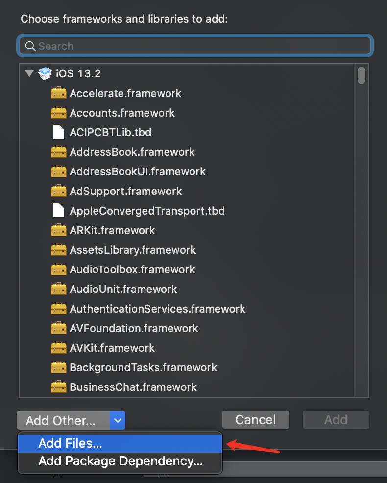
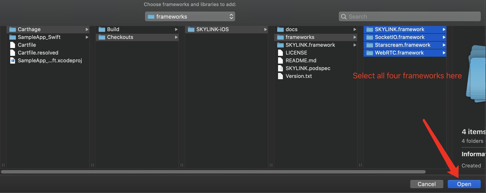
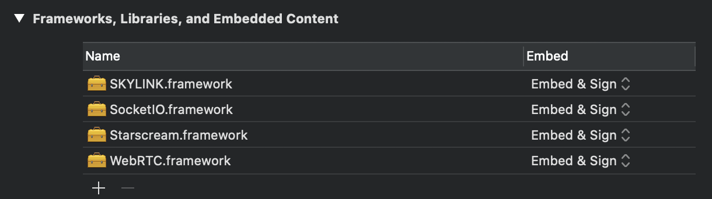

# SkylinkSDK for iOS
   

The **SkylinkSDK for iOS** lets you build real time webRTC applications with voice calling, video chat, P2P file sharing or data and messages exchange. Go multi-platform with our [Web](https://temasys.io/products/sdks/js/) and [Android](https://temasys.io/products/sdks/android/) SDKs.

## Prerequisites
Your project should use [ARC](https://docs.swift.org/swift-book/LanguageGuide/AutomaticReferenceCounting.html)  

## Minimum iOS version required
iOS 9 or higher.

## How to install the SkylinkSDK for iOS on your app

### Step-by-step guide

##### STEP 1  
You can install the SkylinkSDK for iOS via CocoaPods, or Carthage. If you do not have it installed, follow the below steps:

###### Installing Cocoapods  
Check that you have Xcode command line tools installed (Xcode > Preferences > Locations > Command line tools([?](http://osxdaily.com/2014/02/12/install-command-line-tools-mac-os-x/)). If not, open the terminal and run `xcode-select --install`.
Install cocoa pods in the terminal: `$ sudo gem install cocoapods`
###### Installing Carthage 
Download and run the Carthage.pkg file for the latest [release](https://github.com/Carthage/Carthage/releases), then follow the on-screen instructions. If you are installing the pkg via CLI, you might need to run sudo chown -R $(whoami) /usr/local first

##### STEP 2  
If you are using CocoaPods, add the following line to your Podfile:

    pod "SKYLINK"
    #If facing issues with installation, please use:
    #pod 'SKYLINK', :git => 'https://github.com/Temasys/SKYLINK-iOS.git'
If you are using Carthage, add the following line to your Cartfile:
	
    git "https://github.com/Temasys/SKYLINK-iOS.git"
##### STEP 3  
Follow the instructions [here](https://temasys.io/creating-an-account-generating-a-key/) to create an App and a key on the Temasys Console.

##### STEP 4

To create a Swift project using Teamsys iOS SDK, follow these steps:  
###### If you are using CocoaPods:

Your Podfile should look like that:
	
    project 'SampleApp_Swift.xcodeproj'
    platform :ios, '9.0'
    target 'SampleApp_Swift' do
    use_frameworks!
    pod "SKYLINK"
    #If facing issues with installation, please use:
    #pod 'SKYLINK', :git => 'https://github.com/Temasys/SKYLINK-iOS.git'
    end

In the terminal, run `pod install`
###### If you are using Carthage:
Your Cartfile should look like that:
	
    git "https://github.com/Temasys/SKYLINK-iOS.git"

In the terminal, run `carthage update`

#####Note: If you install by Carthage and the installation is successful, you have to link the frameworks to your project, in Xcode, go to "TARGETS" --> "Frameworks, Libraries, and Embedded Content", click "+", in the prompted window "Choose frameworks and libraries to add:", click "Add Other...", "Add Files...", in the prompted window, choose "Carthage" --> "Checkouts" --> "SKYLINK-iOS" --> "frameworks", select all the four frameworks here, then click open, you will see the four frameworks added into your "Frameworks, Libraries, and Embedded Content" window. After that, build your project, see if there is any error

Create the `Project-Bridging-Header.h` and refer to it in build settings (swift compiler section)
Add `#import <SKYLINK/SKYLINK.h>` to the newly created file
You should be able to run your project after this, and use Temasys iOS SDK with Swift.

### Configuring Settings

- After running 'pod install', use the .xcworkspace file. Do not work with the .xcodeproj file.
- For each target planned for use with the SkylinkSDK for iOS:  
    go to Build settings  (make sure “all” is selected) >  
    Build Options >   
    Enable bit code and set it to NO.   
    This will avoid the “…does not contain bitcode” message  

- Optionally, if you want your app to be able to process audio even when the users leaves the app or locks the device, just enable the VoIP background capability or the audio background capability in the target’s “capabilities” tab.
- You may need to specify the swift language version in some pod targets. Use Swift 5.

## Start coding !

The SkylinkSDK for iOS is designed to be simple to use. The main idea when using it is to prepare and create a connection to a "room" via the Temasys platform. After that, you will be able to send messages to the connection and implement the desired protocols to control what happens between the local device and the peers connected to the same "room".

## Resources

### References  

See our [Swift](https://github.com/Temasys/SkylinkSDK_iOS_SampleApp_Swift) and [Objective C](https://github.com/Temasys/SkylinkSDK-iOS-Sample) Sample apps for usage instructions and examples.

### Documentation, Guides and FAQs  
[SDK Documentation](https://cdn.temasys.io/skylink/skylinksdk/ios/latest/docs/html/index.html)  
[Getting started with Temasys iOS SDK for iOS](http://temasys.io/getting-started-skylinksdk-ios/)    
[Handle the video view stretching](http://temasys.io/a-simple-solution-for-video-stretching/)    
[FAQs](http://support.temasys.com.sg/support/solutions/12000000562)  

## Subscribe  
Star this repo to be notified of new release tags. You can also view release notes on our [support portal](http://support.temasys.com.sg/en/support/solutions/folders/12000009706)

## Feedback  
Please do not hesitate to reach get in touch with us if you encounter any issue or if you have any feedback or suggestions on how we can improve the Skylink SDK for iOS or Sample Applications. You can raise tickets on our [support portal](http://support.temasys.io/).
